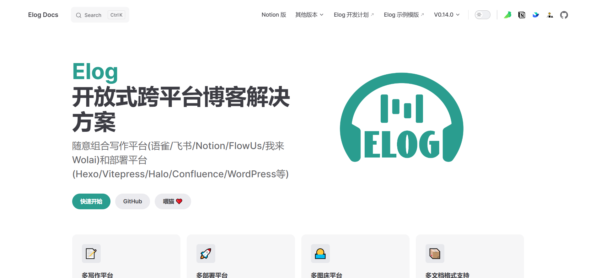
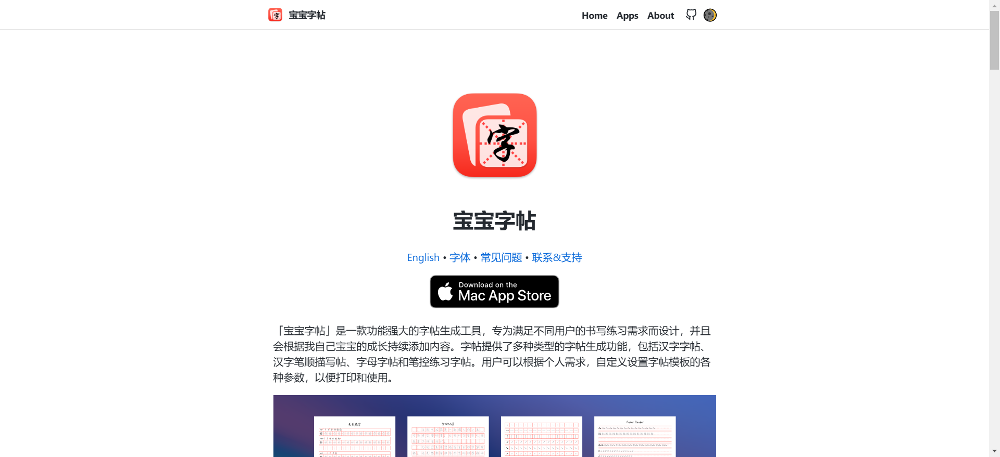

# software

## [28]20240708-20240714

#### [ELog](https://github.com/LetTTGACO/elog)

开源的博客书写发布项目，支持多种博客写作工具和博客发布工具，方便用自己熟悉的博客写作工具发布博客

## [27]20240701-20240707

#### [inwind-landing-page](https://github.com/huglemon/inwind-landing-page)

SaaS产品展示模板项目，方便快速搭建SaaS软件介绍官网

#### [copybook-generator](https://github.com/jaywcjlove/copybook-generator)

开源的MAC平台工具，可以生成字帖练习书法

## [26]20240624-20240630

#### [pic-smaller](https://github.com/joye61/pic-smaller)

可以本地部署的图片无损压缩工具，相比于在线的图片压缩工具可以避免图片被泄露的风险。

#### [certd](https://github.com/certd/certd)

`CertD` 一个免费全自动申请和部署 `SSL` 证书的工具，免费通配符域名 `SSL` 证书全自动申请、续期、部署，支持部署到阿里云、腾讯云

#### [video-subtitle-master](https://github.com/buxuku/video-subtitle-master)

批量为视频生成字幕，并可将字幕翻译成其它语言。这是在之前的一个开源项目 [VideoSubtitleGenerator](https://github.com/buxuku/VideoSubtitleGenerator) 的基础上，制作成的一个客户端工具。