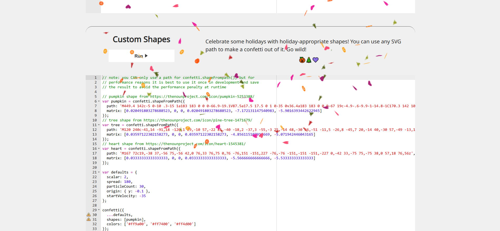
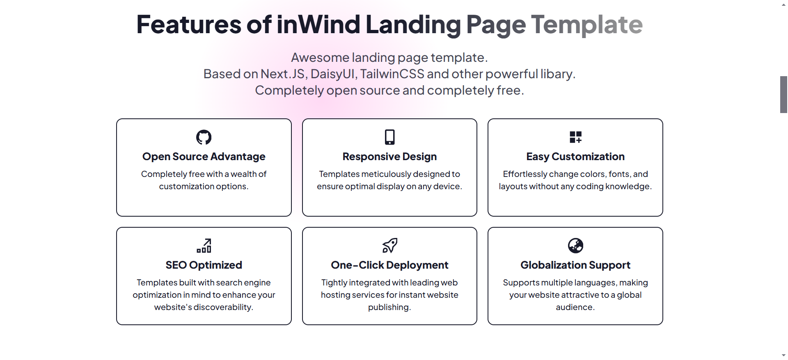

# software

## 【51】20241216-20241222

#### [schemio](https://github.com/ishubin/schemio)

基于web的绘图项目，可以制作各类流程图，也支持制作矢量图。

#### [cursor.directory](https://github.com/pontusab/cursor.directory)

基于编程语言或框架提供适当的cursor提示词，让你的cursor更好用。
## 【50】20241209-20241215
#### [BetterDisplay](https://github.com/waydabber/BetterDisplay)

mac平台显示器调整工具，支持自定义分辨率、XDR/HDR 额外亮度、虚拟屏幕、画中画、软断开连接、配置和 EDID 覆盖、DDC 控制、色彩模式选择、同步、布局保护等众多功能。

#### [cloud bak](https://github.com/likeflyme/cloudbak)

云朵备份是一个微信云备份程序，使用云朵备份可以将微信数据备份到服务器，通过浏览器访问数据，你可以像正常使用微信一样浏览数据和搜索数据（参考微信网页版）。

## 【49】20241202-20241208

#### [PDFMathTranslate](https://github.com/Byaidu/PDFMathTranslate)

基于AI的PDF翻译工具，能在完整保留排版、公式、插图的情况下，将英文文档翻译为中文文档，看论文神器。

#### [Best-websites-a-programmer-should-visit-zh](https://github.com/tuteng/Best-websites-a-programmer-should-visit-zh)

程序员最该访问的最佳网站中文版，仓库里罗列了很多有趣的内容连接，不过仓库上次的更新时间已经是6年前了，有些链接可能已经失效了，可以找找自己感兴趣的内容。

#### [json tree](https://github.com/xzitlou/jsontr.ee)

将JSON转化为树形拓展结构的开源项目，可以更加直观的查看JSON数据，感觉可以参考一下改造成用JSON生成思维导图。

#### [Color-diffusion](https://github.com/ErwannMillon/Color-diffusion)

可以给黑白相片上色的开源项目，用Python书写的有趣的项目。

## 【48】20241125-20241201

## 【47】20241118-20241124

#### [Smart-AutoClicker](https://github.com/Nain57/Smart-AutoClicker)

开源的安卓自动点击软件，提供基于图像识别技术的连续点击功能，同时也支持传统的连续点击功能。

#### [maxun](https://github.com/getmaxun/maxun)

开源的无代码网页数据提取项目，帮你快速构建针对网站的数据抓取任务。

## 【46】20241111-20241117

#### [beautifully crafted animated icons](https://icons.pqoqubbw.dev/)

开源的动画icon图标库，让你的网站交互变得更有有趣一点。

#### [resumake](https://github.com/saadq/resumake.io)

开源免费的在线简历制作工具，使用LaTex构建简历，成品效果很惊艳。

#### [anchordotdev](https://github.com/anchordotdev/cli)

一个为本地项目配置https的的开源项目，保持本地开发环境和线上环境的一致性。

## 【45】20241104-20241110

#### [dazhengs](https://github.com/dazhengs/tools)

开源的纯前端在线加密/解密工具箱，可以离线部署，支持文件加密/解密、对称加密与解密、非对称加密与解密、签名与验签、哈希计算等

#### [typing-practice.toolsnav.top](https://github.com/wincatcher/typing-practice.toolsnav.top)

开源的打字联系平台，界面友好练习内容丰富，且具备专业的数据分析和实时反馈系统。

#### [BilibiliSponsorBlock](https://github.com/hanydd/BilibiliSponsorBlock)

跳过B站视频中恰饭片段的浏览器插件，移植自 [SponsorBlock](https://github.com/ajayyy/SponsorBlock)，目前已经上架[Chrome 应用商店](https://chromewebstore.google.com/detail/eaoelafamejbnggahofapllmfhlhajdd)，支持提交恰饭片段，帮助自己和他人节省时间。

#### [ab-download-manager](https://github.com/amir1376/ab-download-manager)

开源的桌面下载器，支持Windows/Linux平台，支持浏览器插件扩展

## 【44】20241028-20241104

#### [web archive](https://github.com/Ray-D-Song/web-archive)

基于Cloudflarede的免费网页归档和分享工具，可以将你收藏的网站以快照的形式保存到Cloudflare

#### [bookmarks artist](https://github.com/liujuntao123/bookmarks-artist)

开源的chrome浏览器书签查看工具，提供查看的样式还挺好看。

#### [pgmanage](https://github.com/commandprompt/pgmanage)

支持跨平台的 Postgres 数据库的桌面客户端，提供图形界面。

## 【43】20241021-20241027

#### [keyviz](https://github.com/mulaRahul/keyviz)

多平台开源的键盘按下提示项目，实时显示当前按下的按键，很适合做录屏演示。

#### [wechat article exporter](https://github.com/jooooock/wechat-article-exporter)

开源的公众号文章导出工具，支持私有化部署，可用来批量下载公众号文章。

## 【42】20241014-20241026

#### [immich](https://github.com/immich-app/immich)

自托管照片视频管理工具，部署后支持网页和手机端访问

#### [noteshub](https://about.noteshub.app/)

markdown笔记管理软件，支持多端查看，可以插入图表、画板、流程图、公式甚至乐谱，而且支持笔记同步GitHub。

#### [facker server](https://github.com/Ray-D-Song/faker-server)

基于 Faker.js 的 mock 服务器。 使用 MongoDB 作为数据存储，包含一个前端管理页面，可以方便地管理 mock 数据。

#### [notion 2 md demo](https://github.com/thinkerchan/notion2md)

一个notion配合GitHub工作流的实例项目，利用github工作流将notion笔记转化为md格式，并保存到github仓库。

## 【41】20241007-20241013

#### [copi](https://github.com/s1ntoneli/Copi)

macOS上开源的安全剪切板工具，可以阻止三方应用访问剪切板。

#### [TvT.js](https://github.com/hawk86104/icegl-three-vue-tres)

一个融合了ThressJS + Vue3.x + ThresJS三大项目的神奇项目，帮助你使用Vue3.x的语法做3D应用。项目还提供了[在线插件市场](http://oss.icegl.cn/#/)

#### [hexo-themep-sea](https://github.com/hai-zou/hexo-theme-sea)

一个开源的Hexo博客主题，支持国际化和黑暗模式。

## 【40】20240930-20241006

#### [LunarLink](https://github.com/tahitimoon/LunarLink)

基于HttpRunner + Django + Vue + Element UI 的接口自动化测试平台，比较有意思的一个项目。

## 【39】20240923-20240929

#### [certimate](https://github.com/usual2970/certimate)

域名SSL证书自动化管理解决方案，提供域名SSL证书的检查、申请、替换操作，项目完全开源，使用MIT开源协议。

#### [background music](https://github.com/kyleneideck/BackgroundMusic)

mac上的开源小工具，支持在地址栏单独控制每个应用程序的音量。

#### [pake](https://github.com/tw93/Pake)

使用rust将网页打包成桌面应用程序，支持 Windows 打包下设置语言、Linux 下使用 Docker 运行、Linux 和 Windows 下的 App 增加了标题、优化 Pake 打包网页里面关于超链接跳出的处理、支持 Mac 下设置强制黑暗模式。

#### [json4u](https://github.com/loggerhead/json4u/)

开源的JSON工具，支持JSON格式化和各种形式的查看，最重要的是支持JSON的在线树状图谱查看，体验地址：[json4u](https://json4u.cn/)

## 【38】20240916-20240922

#### [DawnLanuncher](https://github.com/fanchenio/DawnLauncher)

`Windows`快捷启动工具，帮助您整理杂乱无章的桌面，分门别类管理您的桌面快捷方式，让您的桌面保持干净整洁。

支持关联文件夹（实时同步文件夹内容）、快速搜索、相对路径（便携路径）、扫描本机开始菜单、本地扫描本机 Appx 应用列表、添加网址并一键获取网址信息。

#### [common intellisense](https://github.com/Simon-He95/common-intellisense)

vscode插件，可以为常用的UI组件库如：element-ui、vuetify 等提供代码提示，提升使用UI组件库的效率/

#### [RTranslator](https://github.com/niedev/RTranslator)

开源的手机APP，实现离线使用翻译功能，支持对话模式和文本模式。

#### [Awesome Dify Workflow](https://github.com/svcvit/Awesome-Dify-Workflow)

一些好用的 Dify 工作流集合，括了中英文翻译、知识库聊天、搜索大师、爆款标题、文章仿写、运营一条龙、聊天机器人、代码生成等工作流。

## 【37】20240909-20240915

#### [PDFQFZ](https://github.com/flytkgl/PDFQFZ)

给pdf加盖骑缝章的小工具，选择需要盖章的PDF文件或文件夹。 选择保存文件夹。 导入完整的印章图片,工具会根据PDF页数做随机分割。 工具支持设定印章大小,骑缝章位置,印章位置等。

#### [wenyan](https://github.com/caol64/wenyan)

md美化工具，可以自动优化md文件排版转换成公众号、今日头条、知乎等平台的样式

#### [hacking tool](https://github.com/Z4nzu/hackingtool?tab=readme-ov-file)

黑客工具箱，一些常用黑客工具集合的仓库，包括匿名、信息收集、SQL注入、逆向工程等等工具包。

## 【36】20240902-20240908

#### [MaxKB](https://github.com/1Panel-dev/MaxKB)

MaxKB = Max Knowledge Base，是一款基于大语言模型和 RAG 的开源知识库问答系统，广泛应用于企业内部知识库、客户服务、学术研究与教育等场景。

- **开箱即用**：支持直接上传文档、自动爬取在线文档，支持文本自动拆分、向量化、RAG（检索增强生成），智能问答交互体验好；
- **模型中立**：支持对接各种大语言模型，包括本地私有大模型（Llama 3 / Qwen 2 等）、国内公共大模型（通义千问 / 智谱 AI / 百度千帆 / Kimi / DeepSeek 等）和国外公共大模型（OpenAI / Azure OpenAI / Gemini 等）；
- **灵活编排**：内置强大的工作流引擎，支持编排 AI 工作过程，满足复杂业务场景下的需求；
- **无缝嵌入**：支持零编码快速嵌入到第三方业务系统，让已有系统快速拥有智能问答能力，提高用户满意度。

#### [cloud dns exporter](https://github.com/eryajf/cloud_dns_exporter)

这个开源工具从DNS提供商，自动获取域名解析，用来检查所有域名（含二级域名）的证书是否过期，目前项目已经支持腾讯云、阿里云和Godaddy。

#### [immich](https://github.com/immich-app/immich)

在服务器搭建私人的照片视频管理平台，同时支持web端和手机端访问，类似的项目还有 [photoprism](https://github.com/photoprism/photoprism) 和 [ente](https://github.com/ente-io/ente)

## 【35】20240826-20240901

#### [ente](https://github.com/ente-io/ente)

开源的双因素认证密码管理器，类似于微软的Authenticator。

#### [xpano](https://krupkat.github.io/xpano/)

开源的照片拼接工具，可以将多张相似的照片拼接成一张照片。

#### [kotaemon](https://github.com/Cinnamon/kotaemon)

开源的本地AI工具，可指定AI模型，与添加的文档聊天。

#### [wifi-card](https://github.com/bndw/wifi-card)

开源的wifi密码生成二维码工具，输入你的wifi账号密码，生成二维码

## 【34】20240819-20240825

#### [moffee](https://github.com/BMPixel/moffee)

开源的markdown制作ppt工具，支持自动分页和样式设置，可以通过网页实时页面预览或导出PPT。

#### [developer2gwy](https://github.com/miss-mumu/developer2gwy)

开源项目程序员考公指南，介绍作者从备考到上岸的经历以及一些经验的分享，不过项目很久没有更新了，部分链接也打不开，只能作为参考信息。类似的项目还有这个 [coder2gwy](https://github.com/coder2gwy/coder2gwy)

## 【33】20240812-20240818

#### [frpc-desktop](https://github.com/luckjiawei/frpc-desktop)

内网穿透工具FRP的桌面客户端，帮助你可视化配置内网穿透，支持所有的FRP版本还支持开机自启。

#### [cosspaste-desktop](https://github.com/CrossPaste/crosspaste-desktop)

跨平台的剪切板管理工具，支持同步window、mac、Linux系统平台的剪切板，方便在各个平台实现自由流畅的剪切板复制粘贴操作。

#### [deeplive](https://deeplive.cam/zh)

通过AI技术仅需一张图片就能实现视频的人脸替换，好强大的技术(≧∇≦)ﾉ

#### [macdata](https://github.com/tomandjerry136/macdata?tab=readme-ov-file)

这个仓库收录4万余条 MAC 地址厂商信息，提供 csv、json 格式下载。

## 【32】20240805-20240811

#### [Quick Recorder](https://github.com/lihaoyun6/QuickRecorder)

MacOS平台的轻量级录屏工具，支持窗口录制, App 录制, 录制移动设备等; 支持窗口声音内录, 鼠标高亮, 隐藏桌面文件等功能。

## 【31】20240729-20240804

#### [orion-visor](https://github.com/dromara/orion-visor)

开源的堡垒机管理项目，界面简洁现代化，而且提供在线版本的SHH连接。

#### [canvas-confetti](https://github.com/catdad/canvas-confetti)

给网站添加庆祝特效的npm库，点击按钮会触发抛洒碎纸的网页特效，作者还提供了演示的[demo网址](https://www.kirilv.com/canvas-confetti/)

#### [x-file-storage](https://github.com/dromara/x-file-storage)

开源的Java项目，一行代码帮你实现文件上传操作，支持目前主流的文件存储服务，如阿里云OSS、华为云OBS、腾讯云COS、FTP等等，很实用的一个开源项目。

## 【30】20240722-20240728

#### [EcoPaste](https://github.com/ayangweb/EcoPaste)

开源的跨平台剪切板管理工具，同时支持Mac平台和Windows平台

#### [hash-wasm](https://github.com/Daninet/hash-wasm)

轻量级的npm哈希函数库，提供了二十几种常见的哈希算法，比如 MD5 和 SHA-1，以及更安全的 BLAKE3。

#### [Sucurose](https://github.com/Taiizor/Sucrose)

开源的Windows桌面壁纸引擎，支持轻量和深色主题，适应多屏和各种分辨率，能创建响应媒体和系统状态的动态壁纸，支持自定义主题和从社区下载主题，优化了 `CPU` 和 `GPU` 使用，节能模式可在笔记本电脑上自动暂停壁纸.

## 【29】20240715-20240721

#### [easyvideotrans](https://github.com/sutro-planet/easyvideotrans)

英文视频转中文开源项目，可以快速将英文视频转换为中文视频，并提供易于操作的web界面，项目提供了一个[在线演示的版本](https://easyvideotrans.com/playground)，可以尝试一下。

#### [mathlive](https://github.com/arnog/mathlive)

一个支持web端输入数学公式的组件，可以用来编辑展示数学公式，拥有简洁易懂的公式输入虚拟键盘，同时支持数学公式输出为LaTeX、MathML、ASCIIMath 和 MathJSON 格式，这是[demo测试地址](https://cortexjs.io/mathlive/demo/)

#### [free-font](https://wangchujiang.com/free-font/)

这个仓库收录了可以免费商用的中文字体，目前已收录499个还在持续更新中。

## 【28】20240708-20240714

#### [ELog](https://github.com/LetTTGACO/elog)

开源的博客书写发布项目，支持多种博客写作工具和博客发布工具，方便用自己熟悉的博客写作工具发布博客

## 【27】20240701-20240707

#### [inwind-landing-page](https://github.com/huglemon/inwind-landing-page)

SaaS产品展示模板项目，方便快速搭建SaaS软件介绍官网

#### [copybook-generator](https://github.com/jaywcjlove/copybook-generator)

开源的MAC平台工具，可以生成字帖练习书法

## 【26】20240624-20240630

#### [pic-smaller](https://github.com/joye61/pic-smaller)

可以本地部署的图片无损压缩工具，相比于在线的图片压缩工具可以避免图片被泄露的风险。

#### [certd](https://github.com/certd/certd)

`CertD` 一个免费全自动申请和部署 `SSL` 证书的工具，免费通配符域名 `SSL` 证书全自动申请、续期、部署，支持部署到阿里云、腾讯云

#### [video-subtitle-master](https://github.com/buxuku/video-subtitle-master)

批量为视频生成字幕，并可将字幕翻译成其它语言。这是在之前的一个开源项目 [VideoSubtitleGenerator](https://github.com/buxuku/VideoSubtitleGenerator) 的基础上，制作成的一个客户端工具。