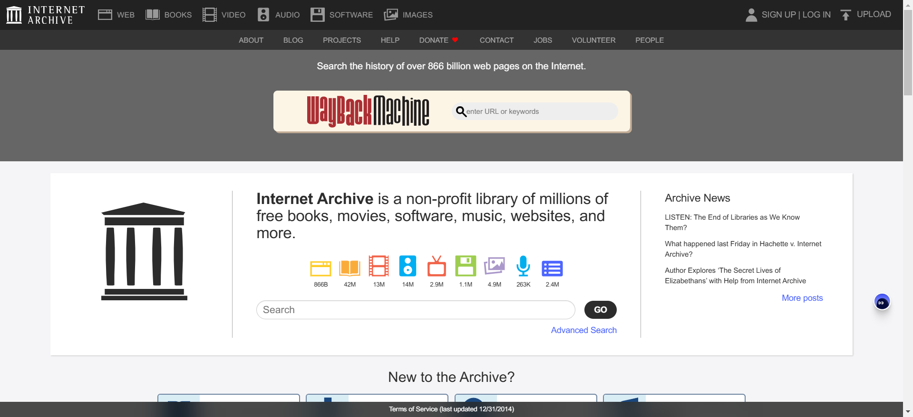

# website

## [27]20240701-20240705

#### [INTERNET ARCHIVE](https://web.archive.org/)

联网档案馆收集了全球绝大部分网站历年的页面，在这里你可以找到数以万计的书籍、电影、软件、音乐、网站等等，比如我就经常用它查找一些老版本的软件，或者查看某些网站的发展变迁考古。

#### [mobilephonemuseum](https://www.mobilephonemuseum.com/catalogue)

手机档案馆，网站列出了常见的手机型号，现在看看3G时代的手机对比现在都很有设计感。

#### [Hacker News Daily](https://www.daemonology.net/hn-daily/)

网站列出 Hack news 前一天讨论前10的话题，帮助你了解最新的科技话题

#### [email.ml](https://email.ml/)

临时邮箱服务器，提供可以使用1个小时的临时邮箱，方便注册一些不想要提供个人邮箱的网站。

## [26]20240624-20240628

#### [查思专利](https://www.chaspark.com/#/patents)

提供专利数据在线检索功能，支持检索全球的专利数据

[IGoo](https://www.igloo.inc/)

一家区块链公司的主页，采用3D构建非常的有科技感

#### [hotkeycheatsheet](https://hotkeycheatsheet.com/zh)

网站记录了常用软件的快捷键，适合查找用

#### [dll-files](https://cn.dll-files.com/)

这个网站可以帮助你在线查找win缺失的 `.dll` 文件

