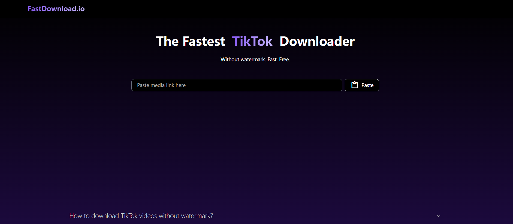
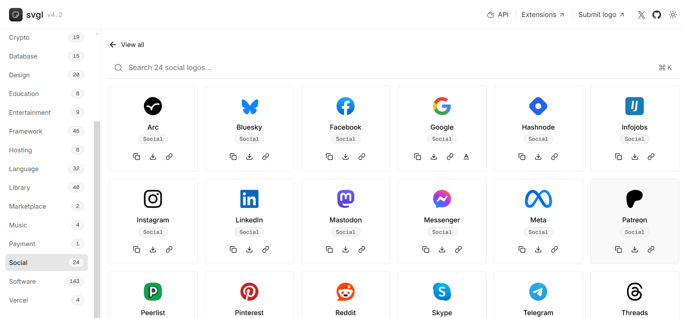

# website

## [30]20240722-20240728

#### [GT Diagram Kit](https://www.figma.com/community/file/1015543187940120536/gt-diagram-kit-isometric-style)

Figma组件库，Isometric 风格的架构图资源，很适合用来画架构图，它的设计风格为Isometric（等轴测风格），适用于各种类型的项目。

#### [fastdownload](https://www.fastdownload.io/)

可以下载流媒体视频的在线工具，支持Youtobe和TikTok

#### [devdoces](https://devdocs.io/)

常用技术文档的汇总集合，可以查询多种主流软件工具的API文档。

## [29]20240715-20240721

#### [book.tsters](https://book.tstrs.me/)

在线电子书搜索网站，点击搜索后会全网查找电子书，并提供下载链接汇集。

作者还提供了一个搜索图书的[api接口](https://book-db-v1.saltyleo.com/)，发送图书的名称或作者的名称可以返回图书或作者的相关信息。

#### [photo2poem](https://photo2poem.top/)

给图片配诗句，根据你上传的图片配上合适的诗句，支持导出图片很有意思的网站。

#### [hellogithub](https://hellogithub.com/)

github项目分类展示网站，在这里能找到很多好玩的github项目，是我周刊的灵感来源

## [28]20240708-20240714

#### [opkfc](https://www.opkfc.com/list)

这个网站提供一些共享的GPT账号，免费使用GPT

#### [life](https://oimo.io/works/life/)

可以无限递归的网站，探讨生命无穷演化的过程，可以任意放大缩小每一个细节，然后你就会发现细节还可以无限放大，就像从宇宙尺度缩放到细胞尺度的感觉，可以体验到宏观到微观，再到微观简直无穷无尽。

小建议：别缩放的太快，要不然会头晕😵

#### [svg app](https://svgl.app/)

常见SVG的集合，包含公司、软件、语言等等

#### [shotki](https://shotki.app/)

生成好看的键盘组合键截图，支持Windows、MacOS、Linux等

#### [bananabin](https://bananabin.app/)

一款MAC软件，给你的废纸篓添加苍蝇乱飞效果，可以设置废纸篓内文件超过大小后显示特效，提示你及时清理废纸篓。

## [27]20240701-20240707

#### [INTERNET ARCHIVE](https://web.archive.org/)

联网档案馆收集了全球绝大部分网站历年的页面，在这里你可以找到数以万计的书籍、电影、软件、音乐、网站等等，比如我就经常用它查找一些老版本的软件，或者查看某些网站的发展变迁考古。

#### [mobilephonemuseum](https://www.mobilephonemuseum.com/catalogue)

手机档案馆，网站列出了常见的手机型号，现在看看3G时代的手机对比现在都很有设计感。

#### [Hacker News Daily](https://www.daemonology.net/hn-daily/)

网站列出 Hack news 前一天讨论前10的话题，帮助你了解最新的科技话题

#### [email.ml](https://email.ml/)

临时邮箱服务器，提供可以使用1个小时的临时邮箱，方便注册一些不想要提供个人邮箱的网站。

## [26]20240624-20240630

#### [查思专利](https://www.chaspark.com/#/patents)

提供专利数据在线检索功能，支持检索全球的专利数据

[IGoo](https://www.igloo.inc/)

一家区块链公司的主页，采用3D构建非常的有科技感

#### [hotkeycheatsheet](https://hotkeycheatsheet.com/zh)

网站记录了常用软件的快捷键，适合查找用

#### [dll-files](https://cn.dll-files.com/)

这个网站可以帮助你在线查找win缺失的 `.dll` 文件

