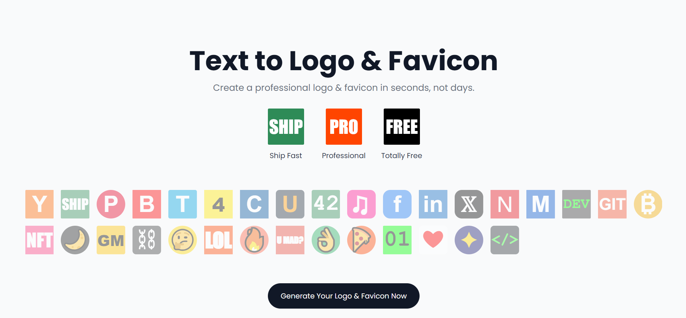
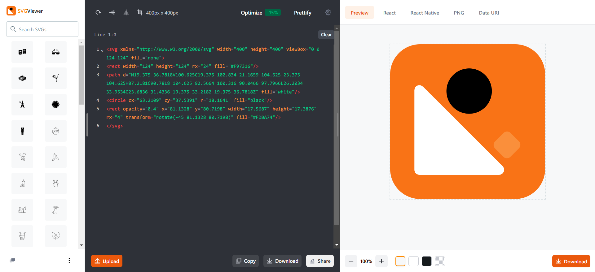
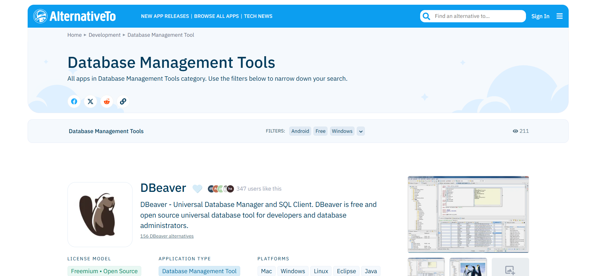
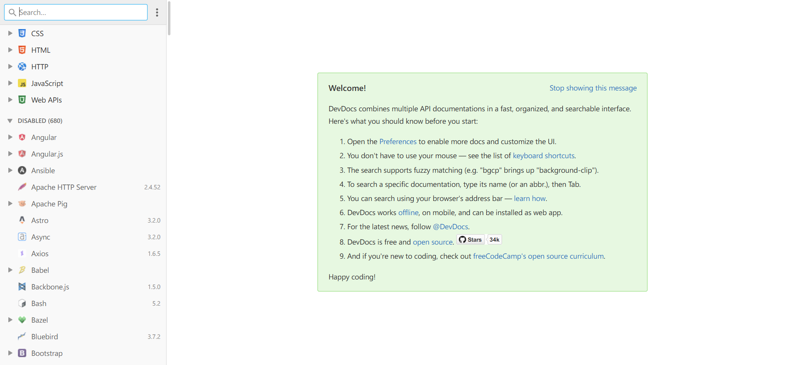
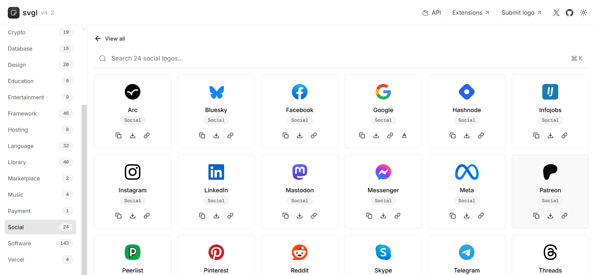
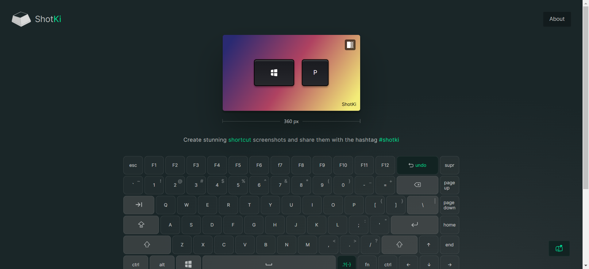
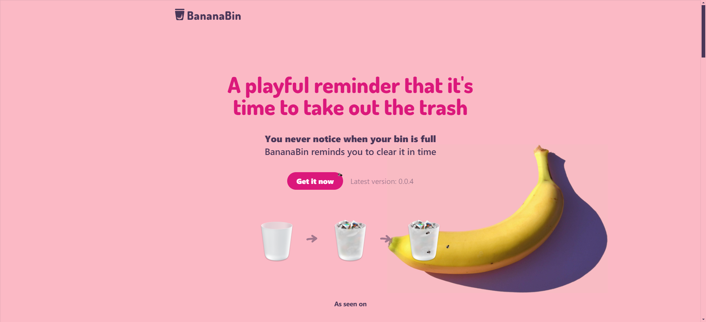
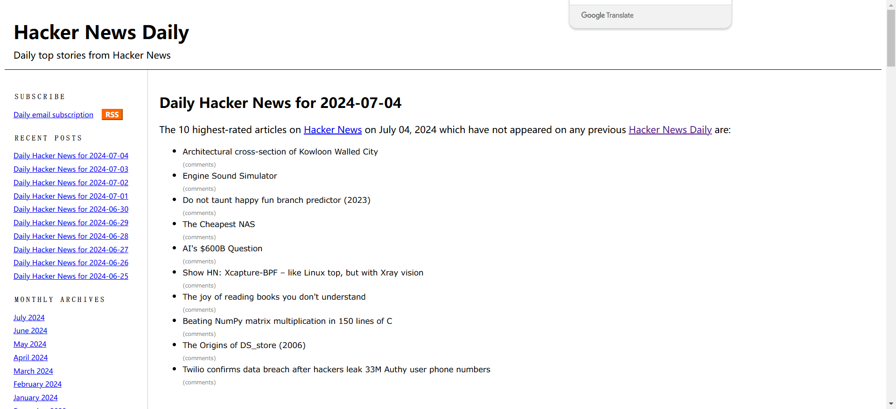
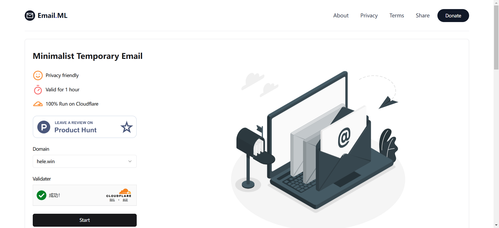

# website

## 【51】20241216-20241222

#### [security headers](https://securityheaders.com/)

请求头安全性检测网站，帮你检查部署的服务，请求头是否是安全的。还有个类似的网站[HTTP安全标头分析器](https://zh.rakko.tools/tools/26/)

#### [github cards](https://github.cards/)

输入你的github账号名，帮你生成你的github介绍卡片。

## 【50】20241209-20241215

#### [public domain radio](http://publicdomainradio.org/en/index.html)

Public Domain Radio 由瑞士的基金会提供的在网络上不间断播放古典音乐、爵士的网站。

#### [favicon](https://favicon.im/)

输入网址就能获取到对应网站的 favicon 图标。

#### [visualization Algorithms](https://www.cs.usfca.edu/~galles/visualization/Algorithms.html)

这个网站用动画的方式展示各种数据结构，方便初学者快速的理解各种数据结构。
如 [BPlusTree](https://www.cs.usfca.edu/~galles/visualization/BPlusTree.html) 就展示了B+ 树的插入、删除、查找、遍历操作，方便直观的理解 B+ 树的数据存储处理模式。

## 【49】20241202-20241208

#### [llmresourceshub](https://llmresourceshub.vercel.app/)

LLM资源聚合网站，包含论文、视频、数据集、开源项目、工具等，提供一站式LLM资源搜索查找。

#### [docker国内镜像源](https://www.wxy97.com/archives/b5b225b6-7741-4560-be2f-2e6a4f671d9b)

截至到目前可用的docker国内镜像源，作者还在一直更新可用镜像链接。

#### [easyresizer](https://easyresizer.com/)

一个在线工具，可以批量调整图片大小。

#### [bylo](https://bylo.ai/zh-CN)

免费的文本生成图片，集成了Flux AI图像生成器，测试图像生成速度还可以。

## 【48】20241125-20241201

## 【47】20241117-20241124

#### [Emoji百科](https://www.emojiall.com/)

可以在这个网站搜索Emoji的来历和解释，还能帮你找到相关的Emoji表情，很有趣的一个网站。

#### [your hacker news](https://yourhackernews.com/)

以报纸形式展示的hacker news，这样看新闻更有感觉，哈哈哈。

#### [best free fonts](https://bestfreefonts.com/)

开源免费的字体，网站支持在线查看字体效果，并提供了获得字体的链接，目前有190多种自字体。

#### [who is making money](https://whoismaking.money/)

通过分析 Stripe 支付流量，来展示各个热门域名的流量，帮你找到一些创业的思路。

## 【46】20241111-20241117

#### [soundbox](https://soundbox.fun/)

可以听白噪音的网站，网站提供了很多种类的白噪音，还可以将不同的白噪音混合起来。

#### [idonthavespotify](https://idonthavespotify.donado.co/)

输入 Spotify 的音乐链接，这个网站就会查找替代音源（比如 Youtube）

## 【45】20241104-20241110

#### [tempmail100](https://tempmail100.com/)

临时邮箱服务，提供网页和IOS程序。

#### [magika](https://google.github.io/magika/)

google开发的文件类型检测工具，支持传入文件检测文件的类型，提供网页版和命令行版。

#### [AI Hear](https://hear.thucydides.net/zh-cn/)

一款在电脑本地运行的私有软件。一键开启多语种实时翻译，管理音频、译文和时间轴，即使身处没有网络的教室、地铁、商场或户外。不收集数据，保护隐私。

## 【44】20241028-20241104

#### [iCraft Editor](https://icraft.gantcloud.com/zh-CN)

在线绘制3D架构图的工具，可以免费使用。

#### [open books hong kong](https://openbookshongkong.com/book/)

先导计划由香港中文大学、香港城市大学和香港大学三家高等教育院校的图书馆与出版社联合发起，是香港首个开放取用（open access）图书计划。本计划将陆续推出三家大学出版社出版的中文学术著作，免费开放予公众阅览、下载、取用和传播。

#### [fresco](https://www.adobe.com/products/fresco.html)

Adobe出品的手绘画图工具，可以免费使用高级功能需要付费，支持跨平台使用。

## 【43】20241021-20241027

#### [ai tts](https://d1tools.com/tools/ai-tts/)

文字转语音工具，利用AI将文字转化成语音的工具，支持74种语言318种声音很适合做配音。

#### [how i experience web today](https://how-i-experience-web-today.com/)

整合你在网上遇到的各种网站打扰，十分真实非常让人高血压。

#### [open slum](https://open-slum.org/)

`SLUM` 网站实时监控多个流行的隐蔽图书馆（如 Anna’s Archive、Library Genesis、Sci-Hub 等）的可用性，并提供这些服务的运行状况、证书有效期以及最近的更新时间。避免你访问到钓鱼网站。

## 【42】20241014-20241026

#### [explainshell](https://www.explainshell.com/)

输入shell命令解析每段参数的含义，帮你理解shell脚本的意思。

#### [devtool](https://devtool.tech/for-star)

一些开发中常用的网页工具集合，在提供转化结果的同时会附带计算过程，帮助你更好的理解进制转化、哈希编码等等操作的具体过程。

#### [surf](https://dns.surf/)

DNS解析测试，检查你的域名在全球互联网的解析情况。

## 【41】20241007-20241013

#### [nothing](https://nothing.mvze.net/)

什么都不做，又或者说「放空」。现在的氛围其实很焦虑，很少有人真的能静下来什么都不做，什么都不想，就发呆。这个网站提倡你什么都不要做，就盯着页面上的秒数上涨，或者走一下神。

#### [littlediffer](https://www.littlediffer.com/)

文字比对工具，支持单词级别的对比，很好用的对比工具。类似工具还有这个：[diffsuite](https://diffsuite.com/)

#### [流光卡片](https://fireflycard.shushiai.com/)

各大平台对文字的渲染展示样式不一致，使用文字卡片可以统一阅读体验，流光卡片可以帮助你制作符合你审美的文字卡片。
还有个开源版本的类似应用 [oneimg](https://github.com/byodian/oneimg)，不过样式没有流光卡片好看。

#### [上市公司财报查询](https://discountingcashflows.com/)

最近股市大热，这个网站可以协助你查看各个上市公司的财报，助你选择合适的股票。

#### [用中文读科技新闻](https://zeli.app/zh)

实时给Hacker News文章链接生成中文摘要，帮你快速浏览感兴趣的科技新闻。黑客新闻官网：[hacker news](https://news.ycombinator.com/)

## 【40】20240930-20241006

#### [有用经验](https://yyjingyan.com/)

网友整理的一些生活中有用的经验，帮你解决生活中的小烦恼避免踩坑。

#### [酷鸭练习站](https://practise.coolielts.com/words/dictation)

免费的雅思听力练习和测验网站，提供多种英语听力语料的听写、校对及统计功能。

#### [开源许可证选择器](https://open-source-license-chooser.toolsnav.top/zh/)

通过提问选择的方式帮助你选择适合你项目的开源许可证的网站。

#### [海棠诗社](https://shi300.com/)

诗词在线查看网站，还有每日一诗功能，给你无聊的生活增加一点诗情画意。

#### [得理法搜](https://data.delilegal.com/)

法律条文、案例在线搜索工具输入案情可以找到所有相关案例，很好用的法律法规搜索类工具。

## 【39】20240923-20240929

#### [they can talk](https://theycantalk.com/)

一个在线的小动物沙雕漫画网站很有意思。

#### [每日值得一读的技术博客](https://daily-blog.chlinlearn.top/)

整合互联网大厂每日发布的微信公众号文章，会找到各种有意思的技术应用场景值得收藏。

#### [渡渡鸟国内镜像站点](https://docker.aityp.com/)

这个网站镜像同步了国外常用的几个镜像仓库，方便拉取镜像。

## 【38】20240916-20240922

#### [xnapp](https://xnapper.com/app)

截图美化工具，可以给你的截图添加各种机器的外壳，比如imac、mac book、ipad等等

## 【37】20240909-20240915

#### [分歧解决机](https://www.pingli.app/)

输入两人的分歧，让7个AI来投票裁决，很有意思。

#### [fnnas](https://fnnas.com/)

飞牛私有云开源系统基于最新 Linux 内核的免费 NAS 系统，兼容主流 x86 硬件，支持灵活存储扩展且个人部署免费。

#### [汉语新解](https://hanyuxinjie.com/)

帮你快速理解热词热梗，听懂别人有没有忽悠你。

#### [24hbook](https://24hbook.store/)

可以在线下载电子书的网站

#### [applite](https://aerolite.dev/applite)

基于homebrew构建的MAC 软件管理应用，可用来安装新应用，也可以管理已经安装的应用，可以方便的安装配置开发环境，且支持使用本地已安装的homebrew。

## 【36】20240902-20240908

#### [dns iui im](https://dns.iui.im/)

公共DNS解析服务器地址大全，网站提供了很多公开的DNS解析服务器地址，方便查询设置自己的DNS解析地址。

#### [easy nomad](https://easynomad.cn/)

这个网站每天收集支持远程办公的岗位，适合找兼职的时候看一看.

## 【35】20240826-20240901

#### [notion exporter](https://notionexporter.com/)

浏览器插件支持将notion导出为图片和卡片形式。

#### [ihavenotv](https://ihavenotv.com/)

可以免费查看英语纪录片的网站

#### [emojis park](https://emojispark.com/)

支持关键词搜索的emoj网站，方便快速找到符合情景的emoj，支持中文搜索。

## 【34】20240819-20240825

#### [freaky font generator](https://freakyfontgenerator.top/)

一款在线字体生成工具，通过Unicode字符编码转换，可以生成各种有趣效果的字体，生成的字体支持一键复制。

#### [aichatru](https://aichatru.ru/zh-CN)

免费的AI在线聊天工具，目前支持GPT-4o和Claude3，无需登陆可以直接发起会话。

## 【33】20240812-20240818

#### [surf](https://www.logo.surf/)

一个制作文字徽标（logo 和 favicon）的在线工具

#### [decohack](https://decohack.com/)

每日 Product Hunt 热门产品的中文榜单，可以帮你发现最近热门的独立开发产品。[代码开源](https://github.com/ViggoZ/producthunt-daily-hot)。

#### [svgviewer](https://www.svgviewer.dev/)

SVG 图标的搜索引擎，并且提供可视化编辑器，允许你对源文件进行调整。

## 【32】20240805-20240811

#### [nvidia explore](https://build.nvidia.com/explore/discover)

nvidia提供的免费大模型调用平台，支持最新的 Llama 3.1 405B 等模型免费调用。

#### [old web today](https://oldweb.today/#19960101/http://geocities.com/)

网站可以选择多种老旧的浏览器，并在浏览器内选择任意的时间，可以看到当时时间节点网站的样式，就像可以交互版的互联网档案馆

#### [实时黄金价格](https://goldprice.fun/)

这个网站整理了各个平台当天的黄金价格，适合做黄金理财的小伙伴。

#### [有用经验](https://yyjingyan.com/)

这个网站整理了很多生活中有用的小技巧、省钱的小妙招等等。

## 【31】20240729-20240804

#### [jpghi](https://jpghi.com/)

无损放大图片的网站，可以把为模糊不清的图片增加细节，提升画面质感，免费版本处理的比较慢。

#### [alternativeto](https://alternativeto.net/)

帮你找到某些软件的平替版本，搜索某一类型软件时会把功能相似的软件都展示出来，方便找到某些付费软件功能相似的开源软件，比如找类似于navicat的数据库管理软件。

## 【30】20240722-20240728

#### [GT Diagram Kit](https://www.figma.com/community/file/1015543187940120536/gt-diagram-kit-isometric-style)

Figma组件库，Isometric 风格的架构图资源，很适合用来画架构图，它的设计风格为Isometric（等轴测风格），适用于各种类型的项目。

#### [fastdownload](https://www.fastdownload.io/)

可以下载流媒体视频的在线工具，支持Youtobe和TikTok

#### [devdoces](https://devdocs.io/)

常用技术文档的汇总集合，可以查询多种主流软件工具的API文档。

## 【29】20240715-20240721

#### [book.tsters](https://book.tstrs.me/)

在线电子书搜索网站，点击搜索后会全网查找电子书，并提供下载链接汇集。

作者还提供了一个搜索图书的[api接口](https://book-db-v1.saltyleo.com/)，发送图书的名称或作者的名称可以返回图书或作者的相关信息。

#### [photo2poem](https://photo2poem.top/)

给图片配诗句，根据你上传的图片配上合适的诗句，支持导出图片很有意思的网站。

#### [hellogithub](https://hellogithub.com/)

github项目分类展示网站，在这里能找到很多好玩的github项目，是我周刊的灵感来源

## 【28】20240708-20240714

#### [opkfc](https://www.opkfc.com/list)

这个网站提供一些共享的GPT账号，免费使用GPT

#### [life](https://oimo.io/works/life/)

可以无限递归的网站，探讨生命无穷演化的过程，可以任意放大缩小每一个细节，然后你就会发现细节还可以无限放大，就像从宇宙尺度缩放到细胞尺度的感觉，可以体验到宏观到微观，再到微观简直无穷无尽。

小建议：别缩放的太快，要不然会头晕😵

#### [svg app](https://svgl.app/)

常见SVG的集合，包含公司、软件、语言等等

#### [shotki](https://shotki.app/)

生成好看的键盘组合键截图，支持Windows、MacOS、Linux等

#### [bananabin](https://bananabin.app/)

一款MAC软件，给你的废纸篓添加苍蝇乱飞效果，可以设置废纸篓内文件超过大小后显示特效，提示你及时清理废纸篓。

## 【27】20240701-20240707

#### [INTERNET ARCHIVE](https://web.archive.org/)

联网档案馆收集了全球绝大部分网站历年的页面，在这里你可以找到数以万计的书籍、电影、软件、音乐、网站等等，比如我就经常用它查找一些老版本的软件，或者查看某些网站的发展变迁考古。

#### [mobilephonemuseum](https://www.mobilephonemuseum.com/catalogue)

手机档案馆，网站列出了常见的手机型号，现在看看3G时代的手机对比现在都很有设计感。

#### [Hacker News Daily](https://www.daemonology.net/hn-daily/)

网站列出 Hack news 前一天讨论前10的话题，帮助你了解最新的科技话题

#### [email.ml](https://email.ml/)

临时邮箱服务器，提供可以使用1个小时的临时邮箱，方便注册一些不想要提供个人邮箱的网站。

## 【26】20240624-20240630

#### [查思专利](https://www.chaspark.com/#/patents)

提供专利数据在线检索功能，支持检索全球的专利数据

[IGoo](https://www.igloo.inc/)

一家区块链公司的主页，采用3D构建非常的有科技感

#### [hotkeycheatsheet](https://hotkeycheatsheet.com/zh)

网站记录了常用软件的快捷键，适合查找用

#### [dll-files](https://cn.dll-files.com/)

这个网站可以帮助你在线查找win缺失的 `.dll` 文件

