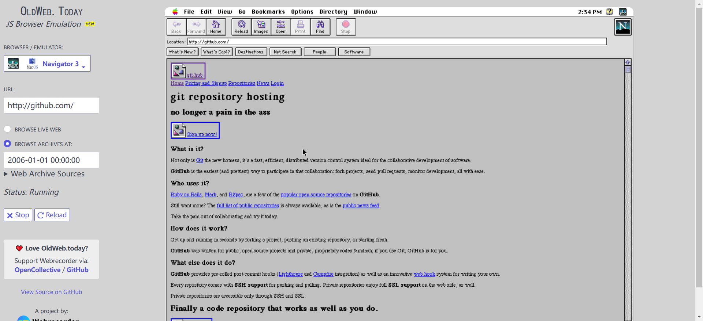

# website

## [38]20240916-20240920

#### [xnapp](https://xnapper.com/app)

截图美化工具，可以给你的截图添加各种机器的外壳，比如imac、mac book、ipad等等

## [37]20240909-20240915

#### [分歧解决机](https://www.pingli.app/)

输入两人的分歧，让7个AI来投票裁决，很有意思。

#### [fnnas](https://fnnas.com/)

飞牛私有云开源系统基于最新 Linux 内核的免费 NAS 系统，兼容主流 x86 硬件，支持灵活存储扩展且个人部署免费。

#### [汉语新解](https://hanyuxinjie.com/)

帮你快速理解热词热梗，听懂别人有没有忽悠你。

#### [24hbook](https://24hbook.store/)

可以在线下载电子书的网站

#### [applite](https://aerolite.dev/applite)

基于homebrew构建的MAC 软件管理应用，可用来安装新应用，也可以管理已经安装的应用，可以方便的安装配置开发环境，且支持使用本地已安装的homebrew。

## [36]20240902-20240908

#### [dns iui im](https://dns.iui.im/)

公共DNS解析服务器地址大全，网站提供了很多公开的DNS解析服务器地址，方便查询设置自己的DNS解析地址。

#### [easy nomad](https://easynomad.cn/)

这个网站每天收集支持远程办公的岗位，适合找兼职的时候看一看.

## [35]20240826-20240901

#### [notion exporter](https://notionexporter.com/)

浏览器插件支持将notion导出为图片和卡片形式。

#### [ihavenotv](https://ihavenotv.com/)

可以免费查看英语纪录片的网站

#### [emojis park](https://emojispark.com/)

支持关键词搜索的emoj网站，方便快速找到符合情景的emoj，支持中文搜索。

## [34]20240819-20240825

#### [freaky font generator](https://freakyfontgenerator.top/)

一款在线字体生成工具，通过Unicode字符编码转换，可以生成各种有趣效果的字体，生成的字体支持一键复制。

#### [aichatru](https://aichatru.ru/zh-CN)

免费的AI在线聊天工具，目前支持GPT-4o和Claude3，无需登陆可以直接发起会话。

## [33]20240812-20240818

#### [surf](https://www.logo.surf/)

一个制作文字徽标（logo 和 favicon）的在线工具

#### [decohack](https://decohack.com/)

每日 Product Hunt 热门产品的中文榜单，可以帮你发现最近热门的独立开发产品。[代码开源](https://github.com/ViggoZ/producthunt-daily-hot)。

#### [svgviewer](https://www.svgviewer.dev/)

SVG 图标的搜索引擎，并且提供可视化编辑器，允许你对源文件进行调整。

## [32]20240805-20240811

#### [nvidia explore](https://build.nvidia.com/explore/discover)

nvidia提供的免费大模型调用平台，支持最新的 Llama 3.1 405B 等模型免费调用。

#### [old web today](https://oldweb.today/#19960101/http://geocities.com/)

网站可以选择多种老旧的浏览器，并在浏览器内选择任意的时间，可以看到当时时间节点网站的样式，就像可以交互版的互联网档案馆

#### [实时黄金价格](https://goldprice.fun/)

这个网站整理了各个平台当天的黄金价格，适合做黄金理财的小伙伴。

#### [有用经验](https://yyjingyan.com/)

这个网站整理了很多生活中有用的小技巧、省钱的小妙招等等。

## [31]20240729-20240804

#### [jpghi](https://jpghi.com/)

无损放大图片的网站，可以把为模糊不清的图片增加细节，提升画面质感，免费版本处理的比较慢。

#### [alternativeto](https://alternativeto.net/)

帮你找到某些软件的平替版本，搜索某一类型软件时会把功能相似的软件都展示出来，方便找到某些付费软件功能相似的开源软件，比如找类似于navicat的数据库管理软件。

## [30]20240722-20240728

#### [GT Diagram Kit](https://www.figma.com/community/file/1015543187940120536/gt-diagram-kit-isometric-style)

Figma组件库，Isometric 风格的架构图资源，很适合用来画架构图，它的设计风格为Isometric（等轴测风格），适用于各种类型的项目。

#### [fastdownload](https://www.fastdownload.io/)

可以下载流媒体视频的在线工具，支持Youtobe和TikTok

#### [devdoces](https://devdocs.io/)

常用技术文档的汇总集合，可以查询多种主流软件工具的API文档。

## [29]20240715-20240721

#### [book.tsters](https://book.tstrs.me/)

在线电子书搜索网站，点击搜索后会全网查找电子书，并提供下载链接汇集。

作者还提供了一个搜索图书的[api接口](https://book-db-v1.saltyleo.com/)，发送图书的名称或作者的名称可以返回图书或作者的相关信息。

#### [photo2poem](https://photo2poem.top/)

给图片配诗句，根据你上传的图片配上合适的诗句，支持导出图片很有意思的网站。

#### [hellogithub](https://hellogithub.com/)

github项目分类展示网站，在这里能找到很多好玩的github项目，是我周刊的灵感来源

## [28]20240708-20240714

#### [opkfc](https://www.opkfc.com/list)

这个网站提供一些共享的GPT账号，免费使用GPT

#### [life](https://oimo.io/works/life/)

可以无限递归的网站，探讨生命无穷演化的过程，可以任意放大缩小每一个细节，然后你就会发现细节还可以无限放大，就像从宇宙尺度缩放到细胞尺度的感觉，可以体验到宏观到微观，再到微观简直无穷无尽。

小建议：别缩放的太快，要不然会头晕😵

#### [svg app](https://svgl.app/)

常见SVG的集合，包含公司、软件、语言等等

#### [shotki](https://shotki.app/)

生成好看的键盘组合键截图，支持Windows、MacOS、Linux等

#### [bananabin](https://bananabin.app/)

一款MAC软件，给你的废纸篓添加苍蝇乱飞效果，可以设置废纸篓内文件超过大小后显示特效，提示你及时清理废纸篓。

## [27]20240701-20240707

#### [INTERNET ARCHIVE](https://web.archive.org/)

联网档案馆收集了全球绝大部分网站历年的页面，在这里你可以找到数以万计的书籍、电影、软件、音乐、网站等等，比如我就经常用它查找一些老版本的软件，或者查看某些网站的发展变迁考古。

#### [mobilephonemuseum](https://www.mobilephonemuseum.com/catalogue)

手机档案馆，网站列出了常见的手机型号，现在看看3G时代的手机对比现在都很有设计感。

#### [Hacker News Daily](https://www.daemonology.net/hn-daily/)

网站列出 Hack news 前一天讨论前10的话题，帮助你了解最新的科技话题

#### [email.ml](https://email.ml/)

临时邮箱服务器，提供可以使用1个小时的临时邮箱，方便注册一些不想要提供个人邮箱的网站。

## [26]20240624-20240630

#### [查思专利](https://www.chaspark.com/#/patents)

提供专利数据在线检索功能，支持检索全球的专利数据

[IGoo](https://www.igloo.inc/)

一家区块链公司的主页，采用3D构建非常的有科技感

#### [hotkeycheatsheet](https://hotkeycheatsheet.com/zh)

网站记录了常用软件的快捷键，适合查找用

#### [dll-files](https://cn.dll-files.com/)

这个网站可以帮助你在线查找win缺失的 `.dll` 文件

