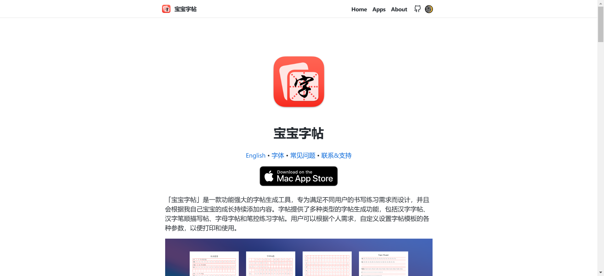
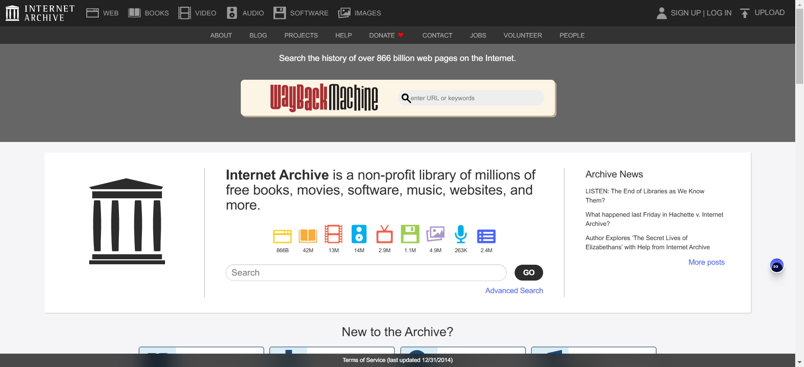

> 收集整理一周所见所闻，包含技术文章资料，开源项目和一些网站工具
> 
> 时间：20240701-20240707
> 
> 周数：第27周

## 📜有价值的文章

#### [大教堂和集市](https://zh.wikipedia.org/wiki/%E5%A4%A7%E6%95%99%E5%A0%82%E5%92%8C%E5%B8%82%E9%9B%86)

*The Cathedral and the Bazaar*）是[埃里克·斯蒂芬·雷蒙](https://zh.wikipedia.org/wiki/%E5%9F%83%E9%87%8C%E5%85%8B%C2%B7%E6%96%AF%E8%92%82%E8%8A%AC%C2%B7%E9%9B%B7%E8%92%99)（Eric Steven Raymond）所撰写的[软件工程](https://zh.wikipedia.org/wiki/%E8%BB%9F%E9%AB%94%E5%B7%A5%E7%A8%8B)方法论。以[Linux](https://zh.wikipedia.org/wiki/Linux)的核心开发过程以及作者自己主持开发的[开放源代码](https://zh.wikipedia.org/wiki/%E9%96%8B%E6%94%BE%E5%8E%9F%E5%A7%8B%E7%A2%BC)[软件](https://zh.wikipedia.org/wiki/%E8%BB%9F%E9%AB%94)──[Fetchmail](https://zh.wikipedia.org/w/index.php?title=Fetchmail&action=edit&redlink=1)为讨论案例。文章在1997年5月27日发表，并在1999年出版成书。

#### [Git 的故事：這一次沒這麼好玩](https://blog.brachiosoft.com/posts/git/)

详细介绍了git诞生和发展过程，一篇很好的软件发展考古文章。

## 🛸开源项目

#### [inwind-landing-page](https://github.com/huglemon/inwind-landing-page)

SaaS产品展示模板项目，方便快速搭建SaaS软件介绍官网

#### [copybook-generator](https://github.com/jaywcjlove/copybook-generator)

开源的MAC平台工具，可以生成字帖练习书法

## 🚀网站&工具

#### [INTERNET ARCHIVE](https://web.archive.org/)

联网档案馆收集了全球绝大部分网站历年的页面，在这里你可以找到数以万计的书籍、电影、软件、音乐、网站等等，比如我就经常用它查找一些老版本的软件，或者查看某些网站的发展变迁考古。

#### [mobilephonemuseum](https://www.mobilephonemuseum.com/catalogue)

手机档案馆，网站列出了常见的手机型号，现在看看3G时代的手机对比现在都很有设计感。

#### [Hacker News Daily](https://www.daemonology.net/hn-daily/)

网站列出 Hack news 前一天讨论前10的话题，帮助你了解最新的科技话题

#### [email.ml](https://email.ml/)

临时邮箱服务器，提供可以使用1个小时的临时邮箱，方便注册一些不想要提供个人邮箱的网站。

## ⛵资料&博文

#### [Git Pro](https://git-scm.com/book/en/v2)

git官方推荐的git使用书籍，认真读完会增加你对git的理解和使用，强烈推荐阅读。

#### [DictionaryByGPT4](https://github.com/Ceelog/DictionaryByGPT4)

一本 GPT4 生成的单词书📚，超过 8000 个单词分析，涵盖了词义、例句、词根词缀、变形、文化背景、记忆技巧和小故事

#### [《高并发的哲学》](https://pphc.lvwenhan.com/)

我们将从动静分离讲起，一步步深入 Apache、Nginx、epoll、虚拟机、k8s、异步非阻塞、协程、应用网关、L4/L7 负载均衡器、路由器(网关)、交换机、LVS、软件定义网络(SDN)、Keepalived、DPDK、ECMP、全冗余架构、用户态网卡、集中式存储、分布式存储、PCIe 5.0、全村的希望 CXL、InnoDB 三级索引、内存缓存、KV 数据库、列存储、内存数据库、Shared-Nothing、计算存储分离、Paxos、微服务架构、削峰、基于地理位置拆分、高可用等等等等。并最终基于地球和人类社会的基本属性，设计出可以服务地球全体人类的高并发架构。

全书共 167956 字。