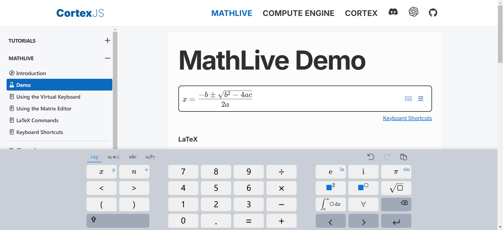
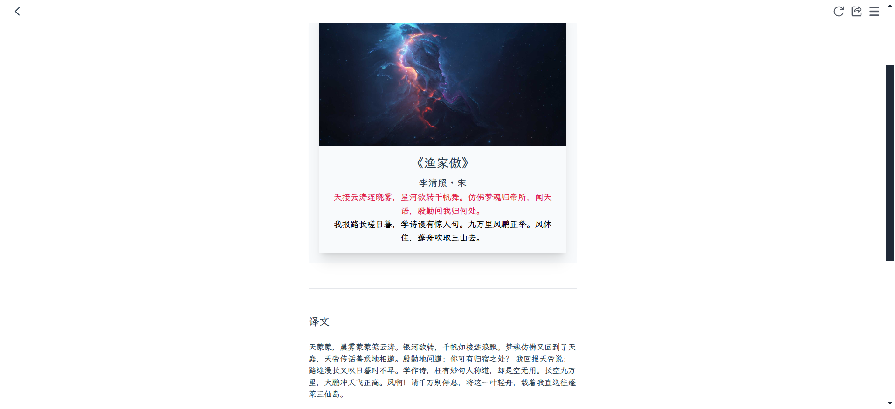

> 收集整理一周所见所闻，包含技术文章资料，开源项目和一些网站工具
> 
> 时间：20240715-20240721
> 
> 周数：第29周

## 📜有价值的文章

#### [life is not short](https://dkb.show/post/life-is-not-short)

文章很有启发性推荐全文阅读，以下是我摘抄的几句：

Life is long enough for you to achieve your wildest dreams. You’re just so busy wasting it that you get to the end without living much of it.

> 生命足够长，足以让您实现最疯狂的梦想。你只是忙于浪费它，以至于你没有活出太多时间就到了终点。

"It is not that we have a short time to live, but that we waste a lot of it. Life is long enough, and a sufficiently generous amount has been given to us for the highest achievements if it were all well invested."

> “并不是说我们的寿命很短，而是我们浪费了很多时间。生命足够长，如果我们充分投资的话，我们已经获得了足够慷慨的资金来取得最高的成就。”

You should stop spending your time on things that don’t matter, and focus on the few things that do.

> 你应该停止把时间花在无关紧要的事情上，而专注于少数重要的事情。

"Assuredly your lives, even if they last more than a thousand years, will shrink into the tiniest span: those vices will swallow up any space of time." 

> “你们的生命，哪怕持续一千多年，肯定也会缩成最短的一段：那些恶习会吞噬任何时间空间。” 

The most surprising thing is that you wouldn’t let anyone steal your property, but you consistently let people steal your time, which is infinitely more valuable.

> 最令人惊讶的是，你不会让任何人偷走你的财产，但你却一直让别人偷走你的时间，而你的时间更有价值

## 🛸开源项目

#### [easyvideotrans](https://github.com/sutro-planet/easyvideotrans)

英文视频转中文开源项目，可以快速将英文视频转换为中文视频，并提供易于操作的web界面，项目提供了一个[在线演示的版本](https://easyvideotrans.com/playground)，可以尝试一下。

#### [mathlive](https://github.com/arnog/mathlive)

一个支持web端输入数学公式的组件，可以用来编辑展示数学公式，拥有简洁易懂的公式输入虚拟键盘，同时支持数学公式输出为LaTeX、MathML、ASCIIMath 和 MathJSON 格式，这是[demo测试地址](https://cortexjs.io/mathlive/demo/)

#### [free-font](https://wangchujiang.com/free-font/)

这个仓库收录了可以免费商用的中文字体，目前已收录499个还在持续更新中。

## 🚀网站&工具

#### [book.tsters](https://book.tstrs.me/)

在线电子书搜索网站，点击搜索后会全网查找电子书，并提供下载链接汇集。

作者还提供了一个搜索图书的[api接口](https://book-db-v1.saltyleo.com/)，发送图书的名称或作者的名称可以返回图书或作者的相关信息。

#### [photo2poem](https://photo2poem.top/)

给图片配诗句，根据你上传的图片配上合适的诗句，支持导出图片很有意思的网站。

#### [hellogithub](https://hellogithub.com/)

github项目分类展示网站，在这里能找到很多好玩的github项目，是我周刊的灵感来源

## ⛵资料&博文

#### [《Pytorch实用教程》第二版](https://github.com/TingsongYu/PyTorch-Tutorial-2nd)

这本书不仅全面介绍了 PyTorch 的基础知识，还包含丰富的 PyTorch 实战案例和大型语言模型部署实例，能帮你快速上手 PyTorch，并具备出色的开发能力。

#### [《hello 算法》](https://www.hello-algo.com/chapter_hello_algo/)

一本介绍算法的开源书籍，文本内提供清晰易懂的动画图解和可运行的代码示例，使读者理解算法和数据结构的核心概念，并能够通过编程来实现它们。在此基础上，本书致力于揭示算法在复杂世界中的生动体现，展现算法之美。