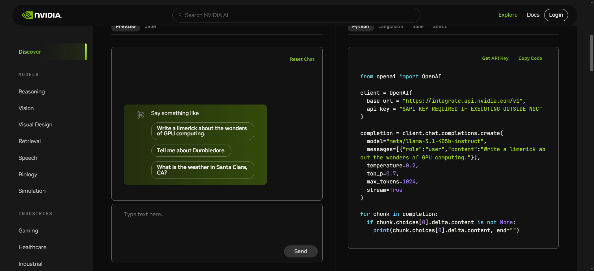
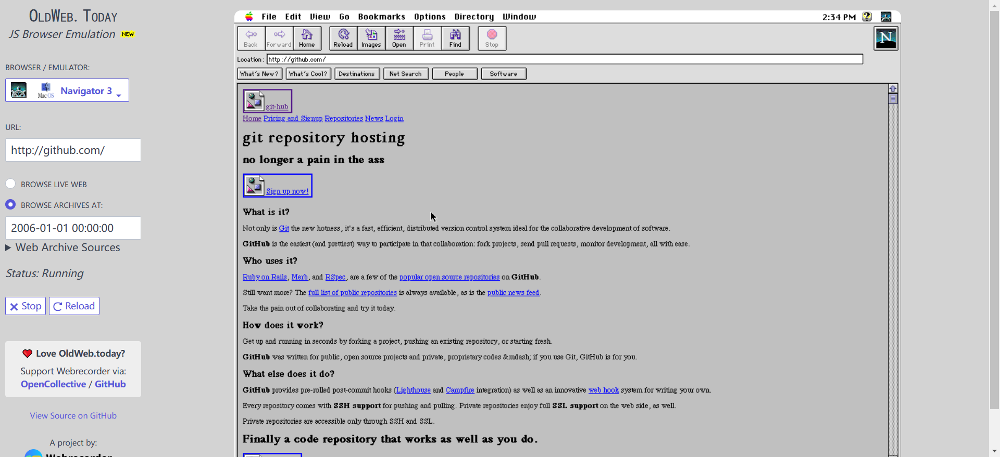
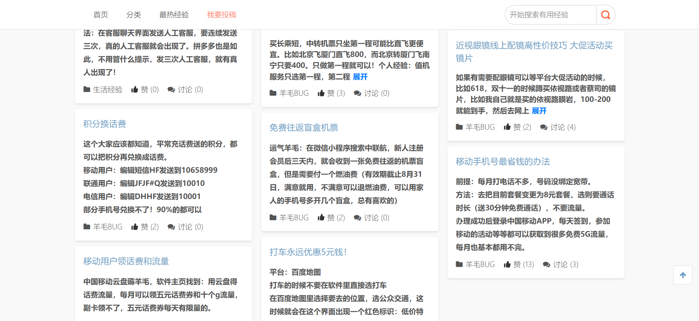

> 收集整理一周所见所闻，包含技术文章资料，开源项目和一些网站工具
> 
> 时间：20240805-202408011
> 
> 周数：第32周

## 📜有价值的文章

#### [turning the tables on ai](https://ia.net/topics/turning-the-tables-on-ai)

一篇关于AI使用的文章，不过作者提供了一个新的使用AI的视角，让AI协助我们思考而不是让AI代替我们思考。通过让AI不断激发我们思考方向和深度的方式让我们自己得出更好的结论，而不是让AI直接给我们答案，这样我们才不会因为AI的发展而变得愚蠢。

下面摘录我很喜欢的内容：

With every thought we outsource, we miss out on a chance to grow. Love it or hate it, AI is here to stay. However we use it, we need to think more, not less.

> 我们把每一个想法都外包出去，就错过了成长的机会。爱也好，恨也罢，人工智能都会留下来。无论我们如何使用它，我们都需要思考更多，而不是更少。

## 🛸开源项目

#### [Quick Recorder](https://github.com/lihaoyun6/QuickRecorder)

MacOS平台的轻量级录屏工具，支持窗口录制, App 录制, 录制移动设备等; 支持窗口声音内录, 鼠标高亮, 隐藏桌面文件等功能。

## 🚀网站&工具

#### [nvidia explore](https://build.nvidia.com/explore/discover)

nvidia提供的免费大模型调用平台，支持最新的 Llama 3.1 405B 等模型免费调用。

#### [old web today](https://oldweb.today/#19960101/http://geocities.com/)

网站可以选择多种老旧的浏览器，并在浏览器内选择任意的时间，可以看到当时时间节点网站的样式，就像可以交互版的互联网档案馆

#### [实时黄金价格](https://goldprice.fun/)

这个网站整理了各个平台当天的黄金价格，适合做黄金理财的小伙伴。

#### [有用经验](https://yyjingyan.com/)

这个网站整理了很多生活中有用的小技巧、省钱的小妙招等等。

## ⛵资料&博文

#### [《语法俱乐部》](https://www.yuque.com/mahuayun/grammar-club)

旋元佑

TIME中文解读版《解读时代杂志》总主笔。第一名考上台大外文研究所，分数几乎是第二名的2倍。

旋元佑老师在台湾完成所有教育，从未出洋留学，但他对外国语文特殊的学习方法，却创下托福满分（677分）及GRE宇汇部分（720分）世界纪录的惊人成就。

旋老师投入英语教学多年，深入了解中文读者学习英语的困难。为了帮助华人英文学习者学好英文，特别设计出一系列《深入浅出》、《只要理解，不要公式》的单元，如《语法俱乐部》、《时代经典用宇》、《字源大挪移》、《修辞高峰会》等。在《解读时代杂志》连载，与读者分享他的学习方法及心得。

#### [《unix-and-linux-sysadmin-notes》](https://github.com/abdoufermat5/unix-and-linux-sysadmin-notes)

unix和Linux系统管理手册，这是原书的开源版本，可以阅读了解一下。

#### [《Vue编译原理揭秘》](https://vue-compiler.iamouyang.cn/)

一本介绍Vuew3源码的书，书里不仅仅告诉你vue3的编译原理，更重要的是提供了一种Debug源码并搞懂问题的方法，掌握了方法自己也能顺畅的查看Vue3的源码。

#### [架构师备考笔记](https://nekonull.me/posts/ruankao-architect/)

文章记录了作者参加今年上半年的软件架构师考试的备考心得，很有价值的一篇文章，推荐想要参加软件架构师考试的小伙伴看一下。