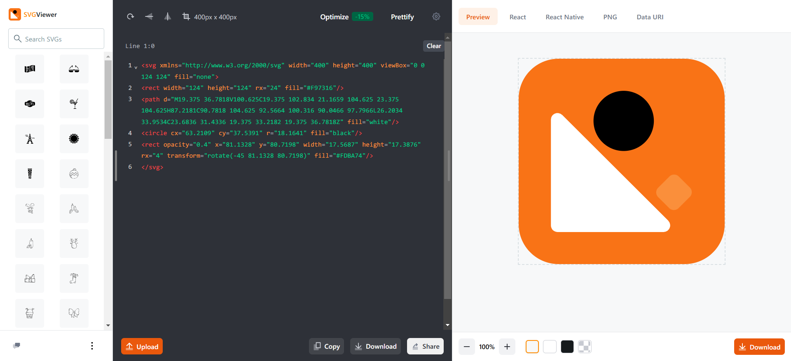

> 收集整理一周所见所闻，包含技术文章资料，开源项目和一些网站工具
> 
> 时间：20240812-20240818
> 
> 周数：第33周

## 📜有价值的文章

#### [Obvious travel advice](https://dynomight.net/travel/)

显而易见的旅行建议，作者在文中提出了很多有趣的旅行小建议，建议全文阅读，下面是我摘录的一些内容：

Mindset matters more than where you go.

> 心态比你去哪里更重要。

If you have to do something really important right after traveling (like a job interview or getting married) you can “pre-adjust” your schedule before leaving. If that’s not an option, you might actually be in better shape on the first day than the second due to having more “residual health”.

> 如果你必须在旅行后立即做一些真正重要的事情（比如工作面试或结婚），你可以在离开前“预先调整”你的日程安排。如果这不是一种选择，由于有更多的“残余健康”，您实际上可能在第一天比第二天处于更好的状态。

Don’t confuse scarcity with value. A really good afternoon in the park (a *really* good one) is maybe about as good as it gets.

> 不要将稀缺性与价值混为一谈。在公园里度过一个非常美好的下午（一个*非常好的*下午）也许就是最好的。

## 🛸开源项目

#### [frpc-desktop](https://github.com/luckjiawei/frpc-desktop)

内网穿透工具FRP的桌面客户端，帮助你可视化配置内网穿透，支持所有的FRP版本还支持开机自启。

#### [cosspaste-desktop](https://github.com/CrossPaste/crosspaste-desktop)

跨平台的剪切板管理工具，支持同步window、mac、Linux系统平台的剪切板，方便在各个平台实现自由流畅的剪切板复制粘贴操作。

#### [deeplive](https://deeplive.cam/zh)

通过AI技术仅需一张图片就能实现视频的人脸替换，好强大的技术(≧∇≦)ﾉ

#### [macdata](https://github.com/tomandjerry136/macdata?tab=readme-ov-file)

这个仓库收录4万余条 MAC 地址厂商信息，提供 csv、json 格式下载。

## 🚀网站&工具

#### [surf](https://www.logo.surf/)

一个制作文字徽标（logo 和 favicon）的在线工具

#### [decohack](https://decohack.com/)

每日 Product Hunt 热门产品的中文榜单，可以帮你发现最近热门的独立开发产品。[代码开源](https://github.com/ViggoZ/producthunt-daily-hot)。

#### [svgviewer](https://www.svgviewer.dev/)

SVG 图标的搜索引擎，并且提供可视化编辑器，允许你对源文件进行调整。

## ⛵资料&博文

#### [Data Science at the Command Line](https://jeroenjanssens.com/dsatcl/)

英文版开源电子书《命令行里的数据科学》，主要讲通过命令行工具学习数据科学。

#### [sweep and prune](https://leanrada.com/notes/sweep-and-prune/)

一篇介绍碰撞检查算法的文章，很值得读一读。